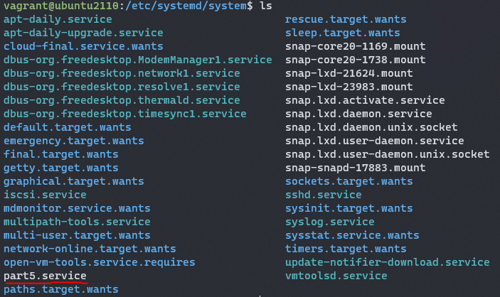
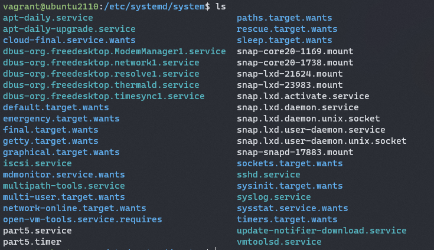

# Exam_2420
Mitchel Webb
A01279081

## part 1
```
sudo apt update
sudo apt upgrade
```

## part 2


made single character changes (replacing 1 with 0, V with C) using `replace` mode by hitting r and typing the new character when the cursor was moved into place (used ctrl+arrows to move cursor quickly)

longer word replacements(replcing numbs with :digit:) made by hitting v to enter `visual` mode and then selecting the word with an arrow key, deleting it, then entering `insert` mode and typing the new word.

## part 3

Searched `current` in the man page to find how to specify the current boot
(no need to specify anything past `-b` since the current boot is the default)


Searched `priority` to find in the man page how to specify priority
(in this case the option is `--priority==4`)


searched `json` to find in the man page how to specify a "nice pretty json"
(in this case the option is `--output-fields=json-pretty`)


##part 4
```
#!/bin/bash

# Search the passwd file in /etc
users=$(grep -E '[[:digit:]]{4}' /etc/passwd)

# Loop through the list of users
for user in $users
do
    # Getting the specific details
    NAME=$(echo $user | cut -d':' -f1)
    UID=$(echo $user | cut -d':' -f3)
    SHELL=$(echo $user | cut -d':' -f7)

    # Checking to make sure UID is between 1000 and 5000
    if [ "$uid" -ge 1000 ] && [ "$uid" -le 5000 ]
    then
        # Printing the data
        # echo "$NAME - $UID - $SHELL"

        # printing the data in the motd file
        cho"$NAME - $UID - $SHELL" >> /etc/motd
    fi
done
```


## part 5
```
[Unit]
Description=Runs the part 4 file which gets user information

[Service]
Type=oneshot
ExecStart=/opt/part4/part4


[Install]
WantedBy=multi-user.target
```



## part 6
```
[Unit]
Description=Timer that runs part5.service to run part4(script) 1 minute after booting + once every day the unit is active. Since this uses a monotonic timer, it counts by seconds. 60 seconds after boot, and then every day, which is 86400 seconds.

[Timer]
OnStartupSec=60
OnUnitActiveSec=86400

[Install]
WantedBy=timers.target
```

Had to name weirdly because of my service fie name


